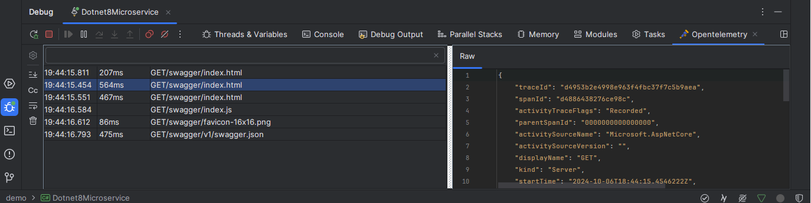

# Opentelemetry Debug Log Viewer For Rider

<!-- Plugin description -->
This plugin allow you to see, instantly view, opentelemetry logs, in a nice way, you can use below list for the backend

- [Honeycomb.io](https://www.honeycomb.io/)

To use just start a debug session with a program.
The logs will appear in a new tab in the debugger session.
<!-- Plugin description end -->

You can enable opentelemetry debug logs with below dependency in your dotnet project

https://www.nuget.org/packages/Ozkanpakdil.OpenTelemetry.Exporter.Json.Console
```xml

<ItemGroup>
    <PackageReference Include="Ozkanpakdil.OpenTelemetry.Exporter.Json.Console" Version="1.0.13"/>
```

### Dev

To edit and test the plugin, just open this project with [InteliJ IDEA](https://www.jetbrains.com/idea/) and run the plugin with predefined run configuration

### Build

```
./gradlew :buildPlugin -PbuildType=stable
```

Then the plugins will be in `build/distributions`

### Screenshot


